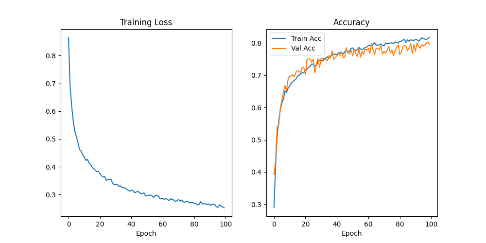
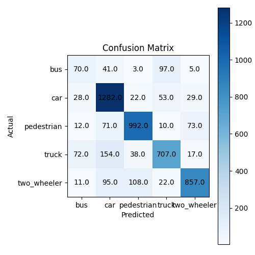
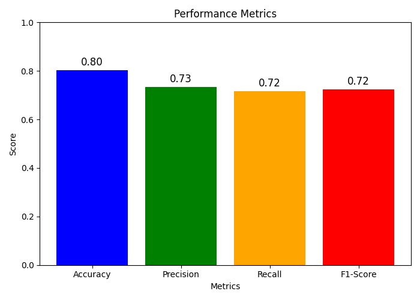

# Training Report for PPGen4NetMini

## Model Summary
| Key | Value |
| --- | ----- |
| num_layers | 11 |
| input_shape | [5, 1, 64, 64] |
| num_classes | 5 |
| num_parameters | 641003 |
| use_tsslbp | True |
| tau_m | 16 |
| tau_s | 1 |
| n_steps | 5 |
| batch_size | 16 |
| learning_rate | 0.0001 |
| desired_count | 4 |
| undesired_count | 1 |
| best_val_acc | 0.80262887656603 |
| best_epoch | 98 |

## Best Model
[Download Best Model](best_model.pt)

## Learning Curves

## Confusion Matrix

## Accuracy Metric

## Ground Truth and Predictions
[Download Ground Truth & Predictions CSV](gt_preds.csv)

## Precision, Recall, F1-Score (Per Class)
| No    | Class | Precision | Recall | F1-Score |
| ----- | ----- | --------- | ------ | -------- |
| 0 |  bus | 0.3627 | 0.3241 | 0.3423 |
| 1 |  car | 0.7803 | 0.9066 | 0.8387 |
| 2 |  pedestrian | 0.8530 | 0.8566 | 0.8548 |
| 3 |  truck | 0.7953 | 0.7156 | 0.7533 |
| 4 |  two_wheeler | 0.8736 | 0.7841 | 0.8264 |
